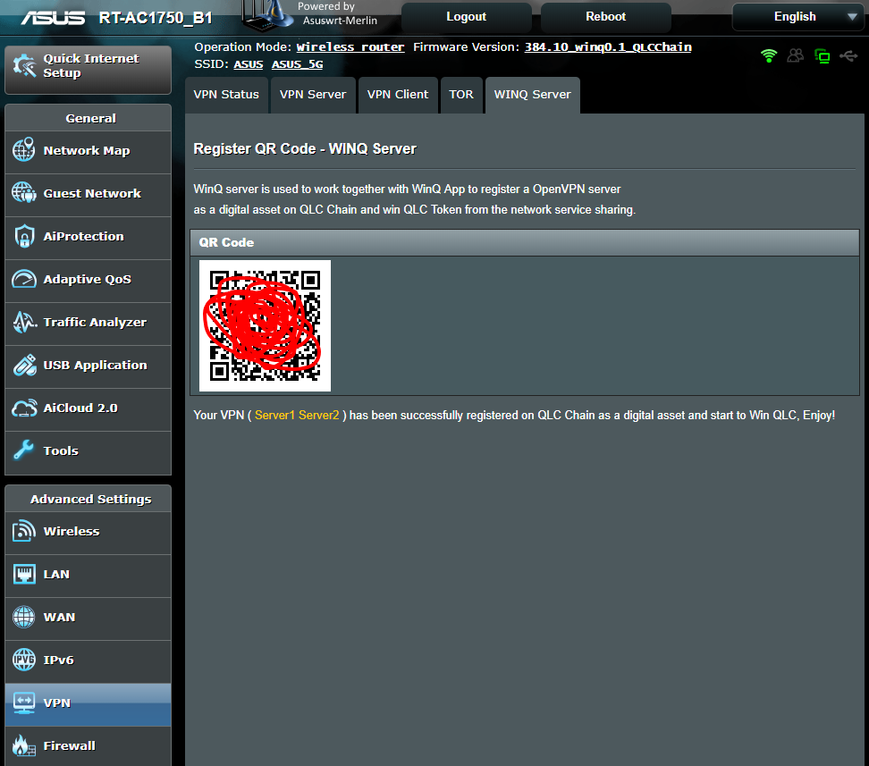

Asuswrt-merlin New Gen 
==================================================

**Asuswrt-Merlin is an enhanced version of Asuswrt, the firmware used by Asus's modern routers.**

The goal of this project is to fix issues and bring some minor functionality adjustments to the
original Asus firmware.  While some features do get added, this is not the main focus of this project.  
It is not meant to replace existing projects such as Tomato or DD-WRT, but rather to offer an alternative
for people who prefer the original firmware featureset.

This is the new development branch, originally based on Asus's 3.0.0.4.382_xxxx firmware release. Development of the 380.xx legacy branch has been dropped.

Please consult the Wiki for an up-to-date list of supported models:

https://github.com/RMerl/asuswrt-merlin/wiki/Supported-Devices

## About asuswrt-merlin WinQ Version

**We forked this branch from official [asuswrt-merlin](https://github.com/RMerl/asuswrt-merlin.ng) and integrated with WinQ Server service.**

The WinQ server is used to work together with WinQ App to register the VPN server as a digital asset on QLC Chain then get reward from the network sharing. As WinQ server maintains the resident of the asset, user-side WinQ App can directly connect to the WinQ server to use the asset, then the server-side WinQ App doesn't need to keep active all the time any more. As a result, both the stability of VPN asset and power saving are extremely improved.

## Building

Please refer to [Building](./Building.md) doc for reference.

## Supported List

https://github.com/RMerl/asuswrt-merlin/wiki/Supported-Devices

Device list we built:
ASUS RT-AC66U_B1(Share the same image of RT-AC68U)
ASUS RT-AC68U
ASUS RT-AC86U

**Tested on ASUS RT-AC66U_B1**

## User Guide of Enable WinQ Server

Please check [User Guide](./release/src/router/winq_server/files//UserGuide.md) for detail info

Here is a Screen Shot when configuration is completed.

