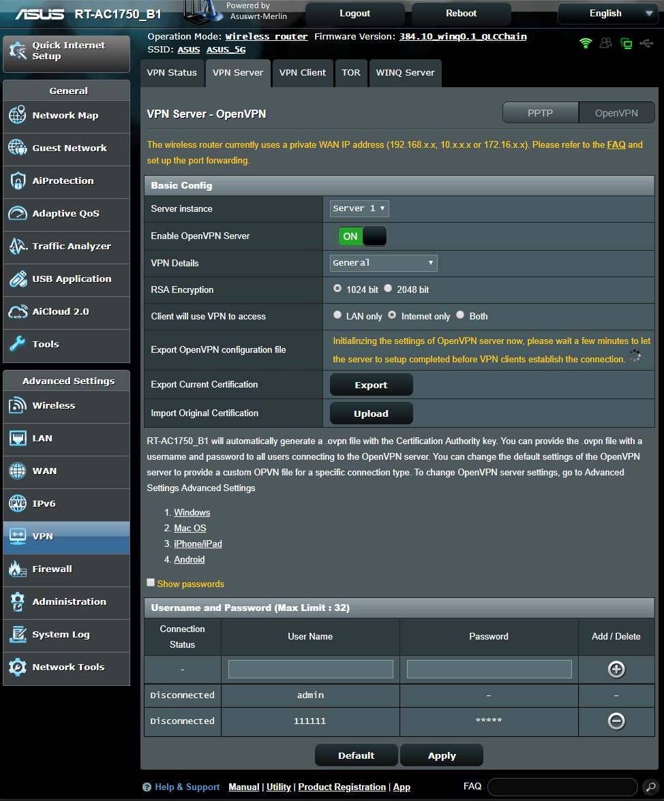
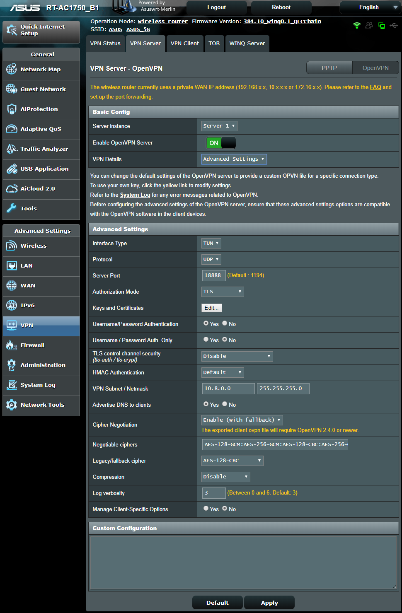
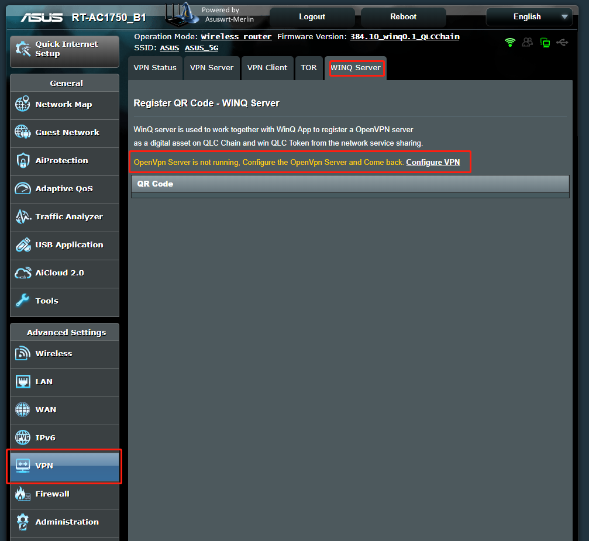
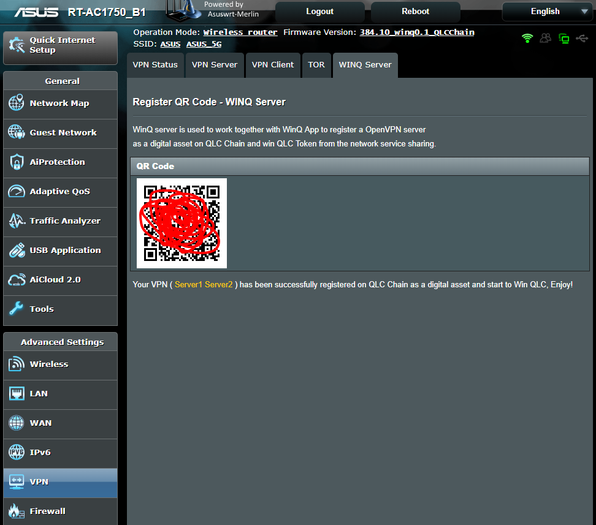
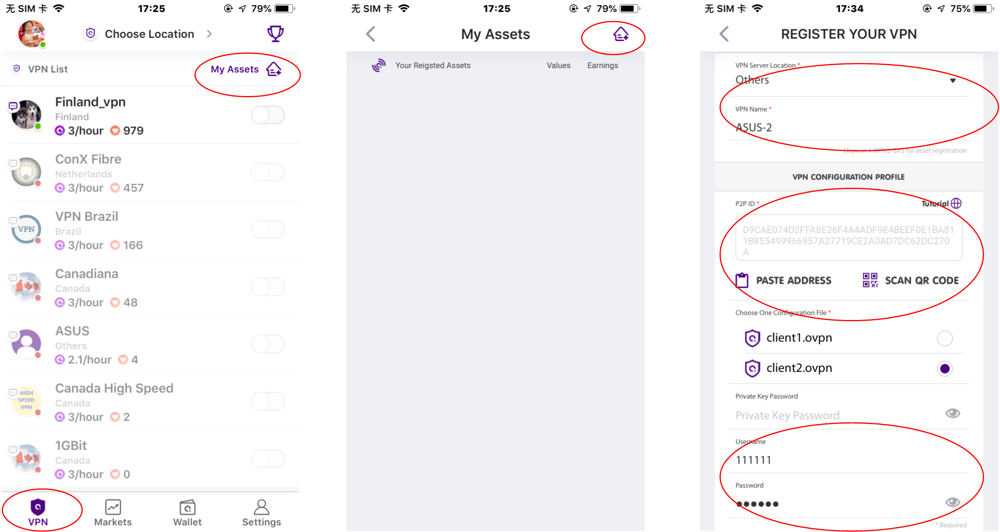
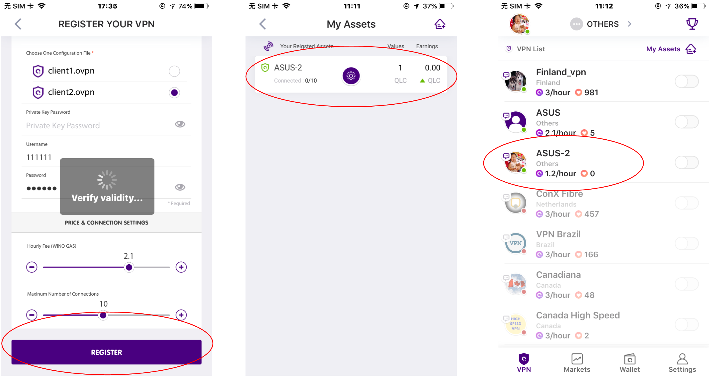

# UserGuide of WinQ Server

As the WinQ server needs to work together with WinQ App to register the VPN server as a digital asset on QLC Chain, it need to both configuration on the Merlin and the WinQ App.

## Configuration on Router

**1, Configure OpenVpn**

  There is document about how to setup OpenVpn Server on Asus [FAQ](https://www.asus.com/support/FAQ/1008713).

  Here is example of Configuration:

 

  **If you don't know how to login in Asus portal, Check this [instruction](https://www.asus.com/support/FAQ/1005263).**

  **Pay attention that if your router doesn't has a public IP address, Make sure to setup the [port forwarding](https://www.asus.com/support/FAQ/1033906).**

**2, Configure WinQ Server**

* Open WinQ Server: VPN->WinQ Server

*  As the screen shot shows, WinQ Server will check if OpenVpn Server is running or not, if not, Click the `Configure VPN`  button to OpenVpn configuration Page.

* If WinQ server check the OpenVpn Server is already running, a QR Code is show out, with which can be used by WinQ App。

Until Now all the setting on Router in completed.

## Register VPN as asset on WinQ App

[WinQ Website](https://winq.net/#home)

[Google Play](https://play.google.com/store/apps/details?id=com.stratagile.winq.dapp&hl=en_US)

[User Guide of WinQ registration](https://medium.com/qlc-chain/how-to-set-up-your-vpn-asset-on-winq-25e2ecbc2357).

1, Open WinQ App, choose VPN->My Assets->Add Assets-:

* Choose location and a Name

* Scan QRcode from the Router
* Click the VPN file
* Input user/password if set

   It may take a minutes or more to get connected from WinQ app to your router after scan the QRcode, Take your time.

2, Click "REGISTER" Button

* WinQ App will check if the VPN server is valid, if yes, registration will finished and you can find the assed  in "My Assets".
* If no, Please check the configuration of VPN on your Router.

